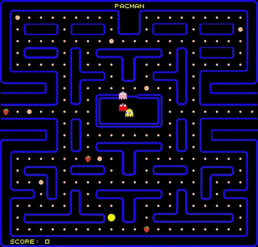

## Pacman

Pacman is an open source implementation of the classic arcade game.

The goal of the game is to eat all the pellets in the maze while avoiding the ghosts. Pacman can eat power pellets to temporarily turn the ghosts blue and allow Pacman to eat them for extra points.

The game can be played using the arrow keys, and the game keeps track of the player's score throughout the game. There are also bonus points awarded for eating boosters.

Pacman is a great game for all ages, and is a great way to spend some time playing a classic arcade game.

This implementation of Pacman was created using the [Ebitengine(v2)](https://github.com/hajimehoshi/ebiten), a 2D game library for Golang.



## Project structure
Pacman consists of 7 general packages:
* [**base**](https://github.com/adanil/Pacman/tree/main/internal/base) - responsible for initializing images and defines base game structure
* [**states**](https://github.com/adanil/Pacman/tree/main/internal/base/states) - contains the various game states such as the main menu, game over, and level complete states.
* [**command**](https://github.com/adanil/Pacman/tree/main/internal/command) - responsible for executing commands for the entities. These commands are used to move the entities around the game world.
* [**controllers**](https://github.com/adanil/Pacman/tree/main/internal/controllers) - contains the various controllers that control the different entities in the game.
* [**entities**](https://github.com/adanil/Pacman/tree/main/internal/entities) - contains the various game entities such as the Pacman character and the ghosts.
* [**level**](https://github.com/adanil/Pacman/tree/main/internal/level) - contains the game level and the associated logic.
* [**utility**](https://github.com/adanil/Pacman/tree/main/internal/utility) - contains various helper functions.

## How to start
```
#build binary
make build

#run binary
./bin/pacman
``` 

### Enjoy!